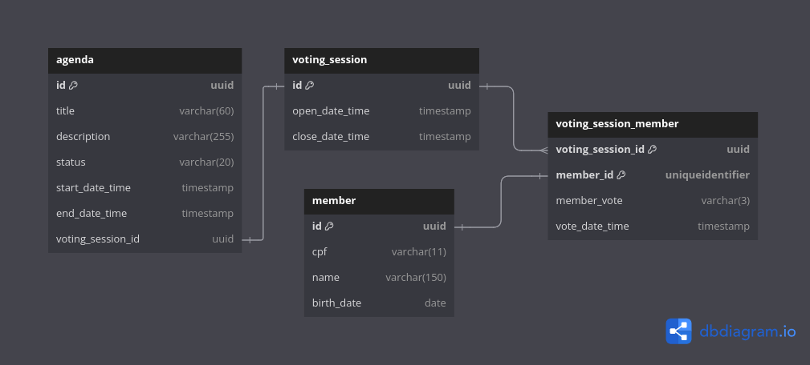

# Projeto Cooperativa

## Descrição

Solução backend para gerenciar essas sessões de votação.

- Cadastrar uma nova pauta
- Abrir uma sessão de votação em uma pauta (a sessão de votação deve ficar aberta por um
tempo determinado na chamada de abertura ou 1 minuto por default)
- Receber votos dos associados em pautas (os votos são apenas ';Sim';/';Não';. Cada
associado é identificado por um id único e pode votar apenas uma vez por pauta)
- Contabilizar os votos e dar o resultado da votação na pauta

## Instruções para Executar o Banco de Dados

Para rodar o projeto é necessário ter o Docker e Docker Compose instalados. Após clonar o projeto, acesse a pasta raiz
do projeto e execute o comando abaixo para subir o banco de dados Postgres.

```bash
docker compose -f stack.yml up
```
Obs: No windows, o comando pode ser diferente, geralmente é `docker-compose up`.

## Instruções para Executar o Projeto
O projeto foi desenvolvido com Java 17 e Spring Boot. Para rodar o projeto, basta executar o comando abaixo na pasta raiz do projeto.

```bash
./mvnw spring-boot:run
```
Obs: Este projeto encontra-se em funcionamento na AWS, segue o link da documentação da API: [Documentação da API](ec2-3-132-215-19.us-east-2.compute.amazonaws.com:8181/swagger-ui/index.html)

## Diagrama do Banco de Dados
[Diagrama DBML](https://dbdiagram.io/d/Cooperative-Project-6712a5d697a66db9a37f1cf3)



## Conceitos aplicados

- DDD
- Hexagonal Architecture
- Design Patterns
- CI/CD - GIthub Actions, Docker e AWS
- Database Migrations
- Testes Unitários
- Testes de integração

## Entidades
    - Pauta como "Agenda" se refere à lista de tópicos ou demandas.
    - Sessão como "Voting session" processo de votação em um período específico.
    - Associado como "Member", uma pessoa com direitos dentro da cooperativa.

## Tecnologias

- Java 17
- Spring Boot
- Postgres
- Docker Compose
- AWS
- Junit
